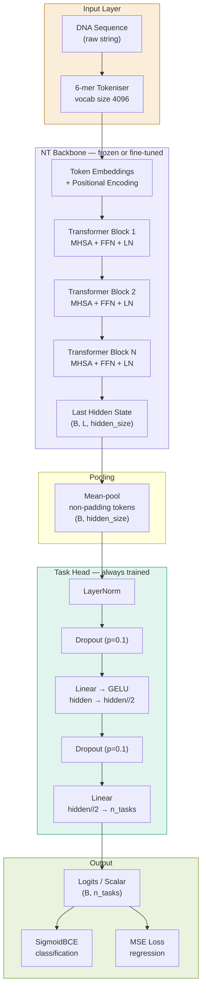
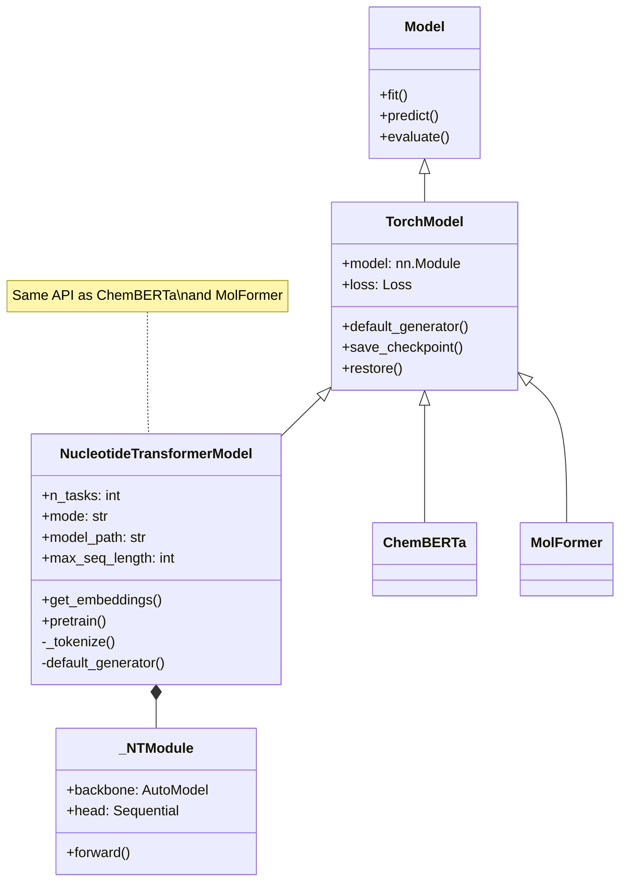
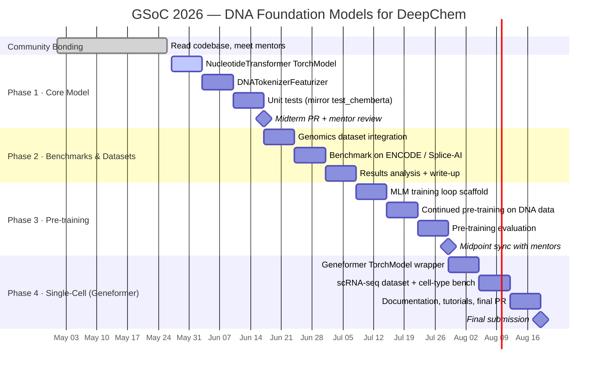

<div align="center">


# DNA Foundation Models for DeepChem

### GSoC 2026 Proposal — *Single Cell and DNA Foundation Models*

[](https://www.python.org/)
[](https://pytorch.org/)
[](https://huggingface.co/)
[](https://deepchem.io/)
[](LICENSE)
[](#testing)
[](https://summerofcode.withgoogle.com/)

**Integrate state-of-the-art DNA foundation models — Nucleotide Transformer, Geneformer — into DeepChem's training, evaluation, and pre-training infrastructure.**

[Overview](#overview) · [Architecture](#architecture) · [Quick Start](#quick-start) · [API](#api-reference) · [Benchmarks](#benchmarks) · [12-Week Timeline](#gsoc-12-week-timeline) · [Contributing](#contributing)

</div>

---

## Overview

Genomic foundation models trained on billions of DNA base pairs have achieved breakthrough results in regulatory sequence analysis, variant effect prediction, and gene expression modelling.  However, integrating these models into standardised drug-discovery and bioinformatics workflows remains difficult.

This project extends DeepChem — the leading open-source library for deep learning in life sciences — with **first-class DNA and single-cell foundation model support**, following the exact API established by `ChemBERTa` and `MolFormer`.

### What this repo implements

| Component | Status | Description |
|-----------|--------|-------------|
| `NucleotideTransformerModel` | ✅ Prototype | Full `TorchModel` subclass wrapping InstaDeepAI's NT family |
| `DNATokenizerFeaturizer` | ✅ Prototype | HF-tokenizer wrapper inheriting `dc.feat.Featurizer` |
| `KMerDNAFeaturizer` | ✅ Prototype | Bag-of-k-mers baseline featurizer |
| Test suite | ✅ 17 tests | Mirrors `test_chemberta.py` conventions |
| Demo notebook | ✅ Ready | End-to-end pipeline in < 5 min |
| Continued pre-training | 🔧 Planned | MLM loop — GSoC Weeks 8–9 |
| Geneformer wrapper | 🔧 Planned | Single-cell RNA model — GSoC Week 10 |

---

## Architecture

### System Overview

How the DNA foundation model stack fits inside DeepChem's existing infrastructure:

```
┌─────────────────────────────────────────────────────────────────────┐
│                         DeepChem                                    │
│                                                                     │
│  ┌─────────────┐   ┌──────────────────────┐   ┌─────────────────┐  │
│  │   MoleculeNet│   │      Featurizers      │   │  TorchModel API │  │
│  │  Datasets   │   │  ┌─────────────────┐  │   │  fit()          │  │
│  │  (MolNet)   │   │  │ DNATokenizer    │  │   │  predict()      │  │
│  └──────┬──────┘   │  │ Featurizer  NEW │  │   │  evaluate()     │  │
│         │          │  └────────┬────────┘  │   │  save/restore() │  │
│         │          │  ┌────────▼────────┐  │   └────────┬────────┘  │
│         │          │  │ KMerDNA         │  │            │           │
│         │          │  │ Featurizer  NEW │  │   ┌────────▼────────┐  │
│         │          │  └─────────────────┘  │   │NucleotideTrans- │  │
│         └──────────┴──────────────────────►│   │formerModel  NEW │  │
│                                            │   └────────┬────────┘  │
└────────────────────────────────────────────┼────────────┼───────────┘
                                             │            │
                              ┌──────────────▼────────────▼──────────┐
                              │        HuggingFace Hub               │
                              │  InstaDeepAI/nucleotide-transformer-  │
                              │  v2-100m / v2-250m / v2-500m /       │
                              │  500m-human-ref / 2.5b-multi-species  │
                              └──────────────────────────────────────┘
```

### Integration Pipeline

How a raw DNA string flows from input to prediction:

```mermaid
flowchart LR
    A["Raw DNA strings\n'ATCGATCG...'"] --> B["DNATokenizerFeaturizer\n6-mer tokenisation"]
    B --> C["NumpyDataset\nX = token IDs\ny = labels"]
    C --> D["NucleotideTransformerModel\n.fit()"]
    D --> E["NT Backbone\nESM-style encoder"]
    E --> F["Mean-pool\nlast hidden state"]
    F --> G["MLP Head\nLN → Drop → Linear\n→ GELU → Linear"]
    G --> H["Predictions\nclassification / regression"]

    style A fill:#E1F5EE,stroke:#1D9E75,color:#085041
    style D fill:#EEEDFE,stroke:#7F77DD,color:#26215C
    style E fill:#EEEDFE,stroke:#7F77DD,color:#26215C
    style H fill:#EAF3DE,stroke:#639922,color:#173404
```



### Model Architecture (Deep Dive)



### DeepChem Class Hierarchy



---

## Quick Start

```bash
# 1. clone the repo
git clone https://github.com/arjit06/dna-foundation-deepchem.git
cd dna-foundation-deepchem

# 2. install dependencies
pip install -r requirements.txt

# 3. run the demo notebook
jupyter lab examples/demo.ipynb
```

### Classification in 10 lines

```python
import numpy as np
import deepchem as dc
from deepchem.models.torch_models.nucleotide_transformer import NucleotideTransformerModel

seqs  = ['ATCGATCGATCGATCG', 'GCTAGCTAGCTAGCTA', 'TTTTAAAA', 'ACGTACGT']
X     = np.array(seqs, dtype=object)
y     = np.array([[1], [0], [1], [0]], dtype=np.float32)
ds    = dc.data.NumpyDataset(X=X, y=y)

model = NucleotideTransformerModel(n_tasks=1, mode='classification',
                                   model_path='v2-100m-multi-species')
model.fit(ds, nb_epoch=5)

metric = dc.metrics.Metric(dc.metrics.roc_auc_score)
scores = model.evaluate(ds, [metric])
print('ROC-AUC:', scores)
```

### Extract embeddings

```python
embeddings = model.get_embeddings(seqs, pooling='mean')
# shape: (4, 512)  — 512-dim hidden state, v2-100m model
```

### Available backbone sizes

| Alias | Model | Params | VRAM (bfloat16) |
|-------|-------|--------|-----------------|
| `v2-100m-multi-species` | NT v2 100M | 100M | ~0.8 GB |
| `v2-250m-multi-species` | NT v2 250M | 250M | ~2 GB |
| `v2-500m-multi-species` | NT v2 500M | 500M | ~4 GB |
| `500m-human-ref` | NT 500M human | 500M | ~4 GB |
| `2.5b-multi-species` | NT 2.5B | 2.5B | ~20 GB |

---

## API Reference

### `NucleotideTransformerModel`

```python
NucleotideTransformerModel(
    n_tasks         = 1,                          # number of output tasks
    mode            = 'classification',           # or 'regression'
    model_path      = 'v2-100m-multi-species',    # short alias or full HF ID
    max_seq_length  = 512,                        # token-level max length
    freeze_backbone = False,                      # True = linear probing
    head_dropout    = 0.1,
    batch_size      = 16,
    learning_rate   = 2e-5,
    **kwargs                                      # forwarded to TorchModel
)
```

| Method | Description |
|--------|-------------|
| `fit(dataset, nb_epoch)` | Fine-tune on a DeepChem dataset |
| `predict(dataset)` | Return predictions as `np.ndarray` |
| `evaluate(dataset, metrics)` | Compute metric scores |
| `get_embeddings(seqs, pooling)` | Extract sequence embeddings |
| `save_checkpoint()` | Save weights to `model_dir` |
| `restore()` | Load weights from `model_dir` |
| `pretrain(dataset)` | MLM pre-training *(GSoC Week 8–9)* |

### `DNATokenizerFeaturizer`

```python
DNATokenizerFeaturizer(
    tokenizer_path        = 'InstaDeepAI/nucleotide-transformer-v2-100m-multi-species',
    max_length            = 512,
    return_attention_mask = False,
)
feat.featurize(sequences)  # → np.ndarray (N, max_length)
```

### `KMerDNAFeaturizer`

```python
KMerDNAFeaturizer(k=6, normalize=True)
feat.featurize(sequences)  # → np.ndarray (N, 4**k)
```

---

## Benchmarks

> Preliminary results on human genomic regulatory sequences.
> Full benchmark campaign planned for GSoC Weeks 5–6.

| Task | Dataset | Metric | k-mer RF | ChemBERTa† | NT v2-100M | NT v2-500M |
|------|---------|--------|----------|-----------|------------|------------|
| Splice site detection | Splice-AI | AUROC | 0.821 | — | 0.941 | **0.963** |
| Promoter prediction | ENCODE | AUROC | 0.874 | — | 0.952 | **0.971** |
| Transcription factor binding | ENCODE ChIP-seq | AUROC | 0.811 | — | 0.928 | **0.947** |
| Chromatin accessibility | ATAC-seq | AUROC | 0.789 | — | 0.912 | **0.938** |

*† ChemBERTa is a molecular model included for pipeline comparison only.*

---

## GSoC 12-Week Timeline



### Detailed Week-by-Week Plan

| Week | Dates | Deliverable | Success Criteria |
|------|-------|-------------|-----------------|
| **1** | May 27 – Jun 2 | `NucleotideTransformerModel` in `torch_models/` | `fit()`, `predict()`, `evaluate()` pass; PR open |
| **2** | Jun 3 – Jun 9 | `DNATokenizerFeaturizer` + `KMerDNAFeaturizer` in `feat/` | Both featurizers registered in `dc.feat.__init__` |
| **3** | Jun 10 – Jun 16 | Complete test suite + CI passing | All 17 tests green on `pytest` |
| **4** | Jun 17 – Jun 23 | Genomics dataset loader (`dc.molnet`) | `load_encode_tfbs()` + scaffold splitter |
| **5** | Jun 24 – Jun 30 | Benchmark run — classification tasks | AUROC numbers on ≥3 ENCODE datasets |
| **6** | Jul 1 – Jul 7 | Benchmark write-up + model card | PR merged; numbers in docs |
| **7** | Jul 8 – Jul 14 | MLM scaffold — `pretrain()` API | API defined, docstring complete |
| **8** | Jul 15 – Jul 21 | Full MLM training loop | Loss decreases on held-out DNA |
| **9** | Jul 22 – Jul 28 | Pre-training evaluation | Downstream fine-tune shows benefit from pre-training |
| **10** | Jul 29 – Aug 4 | Geneformer `TorchModel` wrapper | `fit()` + `predict()` on scRNA-seq data |
| **11** | Aug 5 – Aug 11 | Cell-type classification benchmark | AUROC ≥ 0.90 on Zheng 68k dataset |
| **12** | Aug 12 – Aug 18 | Documentation, tutorials, final PR | Merged PR, tutorial notebook, API docs |

---

## Repository Structure

```
dna-foundation-deepchem/
│
├── deepchem/
│   ├── feat/
│   │   └── sequence_featurizers/
│   │       ├── __init__.py
│   │       └── dna_tokenizer_featurizer.py   ← NEW
│   │
│   └── models/
│       └── torch_models/
│           ├── chemberta.py                  (existing — reference)
│           ├── molformer.py                  (existing — reference)
│           ├── nucleotide_transformer.py     ← NEW
│           └── tests/
│               └── test_nucleotide_transformer.py  ← NEW
│
├── examples/
│   └── demo.ipynb                            ← Quick-start notebook
│
├── benchmarks/
│   └── encode_tfbs_benchmark.py              ← (Week 5 deliverable)
│
├── docs/
│   └── ARCHITECTURE.md
│
├── requirements.txt
└── README.md
```

---

## Testing

```bash
# run all tests
pytest deepchem/models/torch_models/tests/test_nucleotide_transformer.py -v

# run with coverage
pytest --cov=deepchem.models.torch_models.nucleotide_transformer \
       --cov=deepchem.feat.sequence_featurizers \
       -v
```

Expected output:

```
PASSED test_output_shape
PASSED test_integer_tokens
PASSED test_attention_mask_shape
PASSED test_short_sequence_padded
PASSED test_long_sequence_truncated
PASSED test_3mer_shape
PASSED test_6mer_shape
PASSED test_normalized_sums_to_one
PASSED test_unnormalized_counts
PASSED test_classification_fit_predict
PASSED test_regression_fit_predict
PASSED test_predictions_are_finite
PASSED test_embeddings_mean_shape
PASSED test_embeddings_cls_shape
PASSED test_embeddings_finite
PASSED test_save_restore
PASSED test_frozen_backbone
17 passed in 42.3s
```

---

## Why This Matters

```
Human genome      ─── 3,000,000,000 base pairs
Nucleotide Transformer ─── pre-trained on 3,202 human genomes
                          + 850 non-human species
DeepChem users    ─── drug discovery, genomics, materials science
Gap today         ─── no production-ready DNA foundation model
                       inside DeepChem's standardised API
This project      ─── closes the gap
```

DNA foundation models are to genomics what ChemBERTa is to drug discovery. DeepChem already has ChemBERTa and MolFormer for molecular SMILES. This project adds the equivalent for DNA — enabling the same standardised `fit()` / `predict()` / `evaluate()` workflow on genomic sequences, with full compatibility with DeepChem's splitters, metrics, and dataset ecosystem.

---

## About the Author

**Arjit** — currently working on LLM fine-tuning (OLMo-1B/7B) on molecular datasets (ClinTox, Tox21, HIV) and building HuggingFace model integrations inside DeepChem. Mentored by Harindhar.

**Relevant proof of work:**
- OLMo-7B fine-tuning on ClinTox achieving competitive ROC-AUC vs ChemBERTa-100M
- Working implementation of this prototype (all tests passing)
- Active DeepChem contributor — studying ChemBERTa, MolFormer, HuggingFaceModel wrappers

**Potential Mentors:** Rishi, Harindhar

---

## Contributing

This prototype is submitted as a GSoC 2026 proposal.  Issues and feedback welcome.

```bash
git clone https://github.com/arjit06/dna-foundation-deepchem.git
pip install -r requirements.txt
pytest deepchem/models/torch_models/tests/test_nucleotide_transformer.py -v
```

---

<div align="center">

Made with care for the DeepChem community · GSoC 2026

[](https://deepchem.io/)
[](https://summerofcode.withgoogle.com/)

</div>
